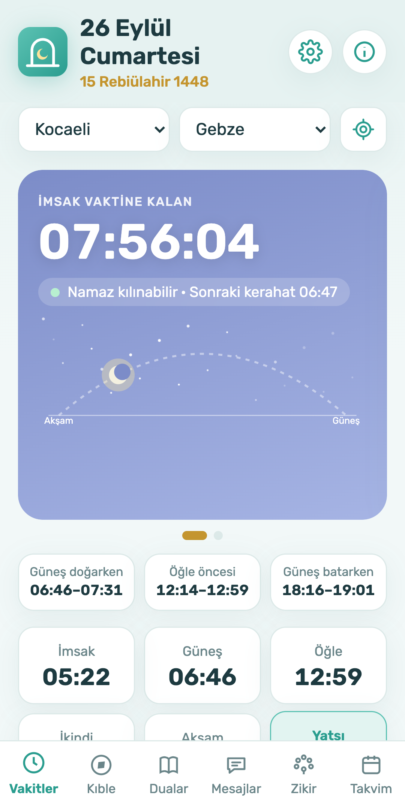
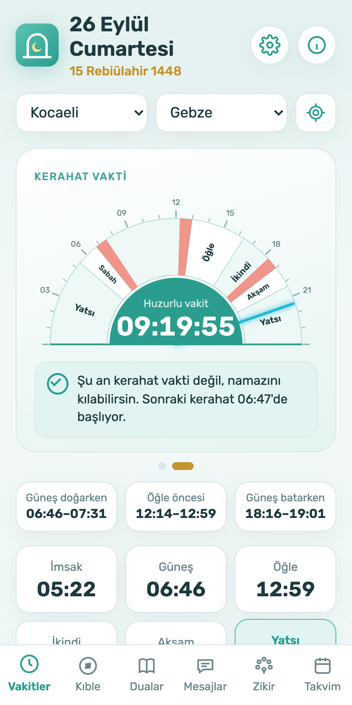
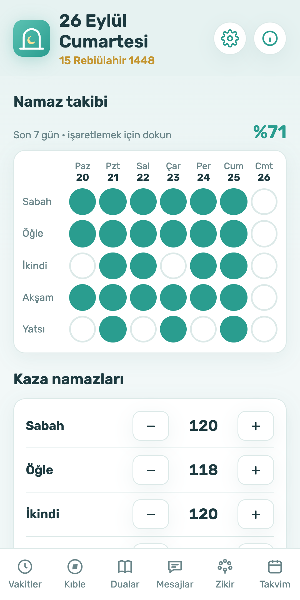
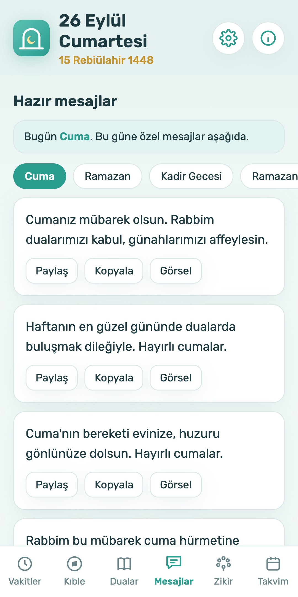
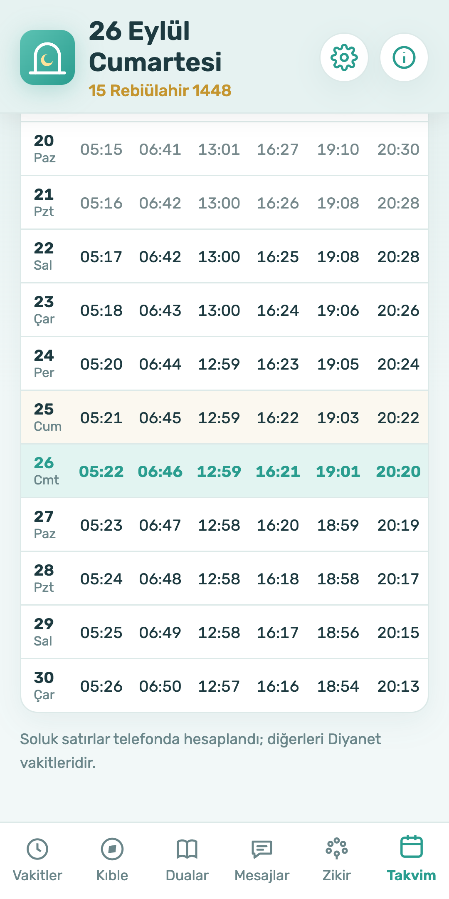
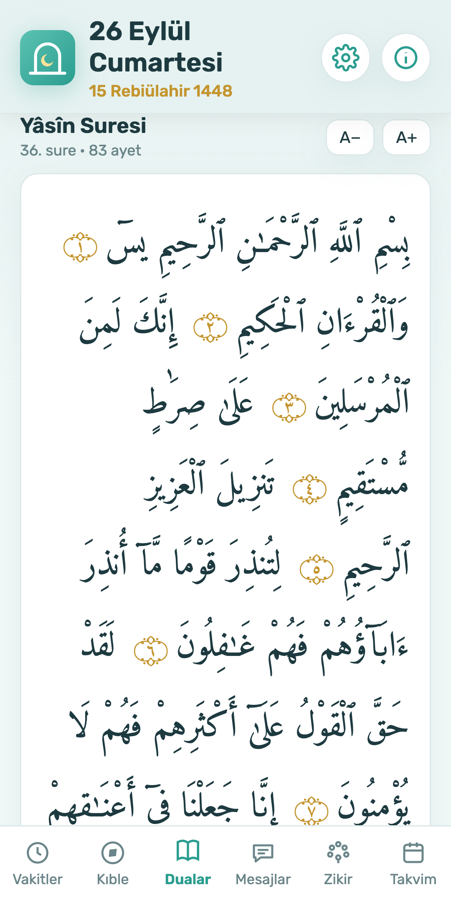
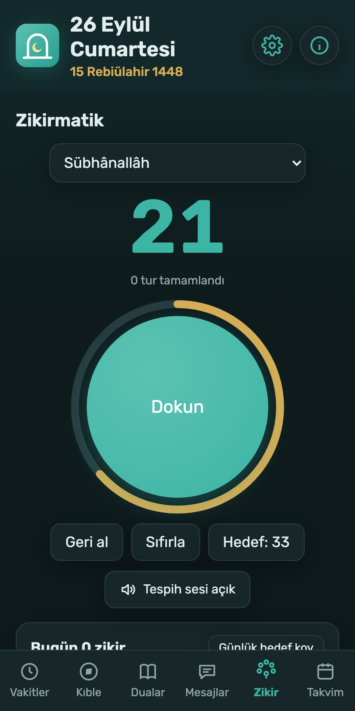
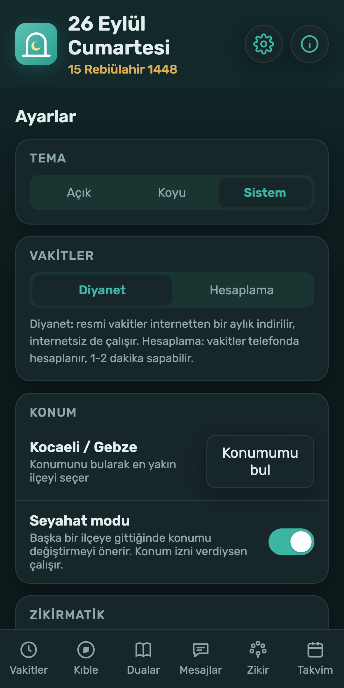

# Vakit ve Dua: Namaz Vakitleri & İbadet Rehberi

**Vakit ve Dua**, Müslümanların günlük ibadetlerini huzurla ve kolaylıkla eda edebilmeleri için tasarlanmış; modern, sade, güvenilir ve tamamen çevrimdışı çalışabilen bir Android uygulamasıdır.

"Sakin, hürmetkâr, zamansız" tasarım kimliği ilkesiyle geliştirilen uygulama; geleneksel hat sanatı estetiğini ve kitap dokusunu modern mobil arayüzle buluşturur.

---

## 📱 Ekran Görüntüleri ve Görsel Galeri

  
  
  
  

  
  
  
  

---

## ✨ Öne Çıkan Özellikler

### 🌙 Namaz Vakitleri & Dinamik Vakit Kartı
- **Diyanet Hesabı:** Diyanet İşleri Başkanlığı astronomik vakit hesaplama yöntemiyle Türkiye'deki **81 il ve 973 ilçe** için %100 çevrimdışı çalışan namaz vakitleri.
- **Konum Biçimi:** Seçilen konum için `İSTANBUL-Maltepe` gibi il ve ilçe uyumlu net görünüm.
- **Canlı Geri Sayım:** Bir sonraki vakte kalan süreyi saniye hassasiyetinde gösteren vakit göstergesi.

### ☀️ Kerahat Vakitleri & 24 Saatlik Görsel Kadran
- **Görsel Kadran:** Günün 24 saatini ve vakit aralıklarını gösteren interaktif dairesel kadranda güneş doğuşu, öğle öncesi (istiva) ve güneş batışı kerahat vakitlerini anlık takip etme imkânı.
- **Detaylı Uarı:** Kerahat vakti girdiğinde kalan süreyi ve fıkhi bilgilendirmeyi gösteren uyarı sistemi.

### 🧭 Kıble Pusulası & Güneş Doğrulama
- **Gerçek Zamanlı Pusula:** Cihazın manyetik sensörleri ile çalışan yüksek hassasiyetli kıble pusulası. Kıble yönüne tam hizalanıldığında titreşimli geri bildirim.
- **Güneş ile Doğrulama:** Pusula sapmalarına karşı gündüz vakitlerinde güneşin açısına göre kıble açısını doğrulama rehberi ve Kâbe mesafesi hesabı.

### 📿 Zikirmatik
- **Dokunsal Sayaç:** Gerçek zikirmatik hissi veren dairesel dokunma alanı ve ilerleme halkası.
- **Titreşim & Hedef:** 33, 99, 100, 1000 hedef seçenekleri, her tur tamamlandığında uyarı ve özel zikir ekleme seçeneği.

### 📖 Kur'an-ı Kerim
- **Tanzil Metinleri:** 114 surenin tamamı orijinal Arapça Tanzil metinleriyle.
- **Hızlı Arama & Yer İmi:** Sure adına göre anında arama yapma ve en son kaldığınız yeri kaydedip tek tıkla devam etme.

### 🤲 Dualar, Esmâü'l-Hüsnâ & İbadet Rehberi
- **Kategorize Dua Kütüphanesi:** Namaz duaları, günlük dualar, Kur'an-ı Kerim'den dualar ve Peygamber Efendimizin (s.a.v.) duaları (Arapça, Okunuş ve Meal).
- **Esmâü'l-Hüsnâ:** Allah'ın 99 isminin anlamları ve faziletleri.
- **Resimli İbadet Rehberi:** Abdest alınışı ve 5 vakit namazın adım adım kılınış rehberi.

### 📊 Namaz Takibi & Kaza Sayacı
- **Haftalık Namaz Takibi:** Günlük 5 vakit namazın kılındığını interaktif olarak işaretleme ve haftalık devamlılık takibi.
- **Kaza Sayacı:** Kaza namazları (Sabah, Öğle, İkindi, Akşam, Yatsı, Vitir ve Oruç) için pratik sayaç ve hızlı güncelleme.

### ✉️ Tebrik & Kandil Mesajları
- Cuma, Kandil, Ramazan ve Bayram günleri için özenle seçilmiş tebrik mesajları. Tek tıkla kopyalama ve WhatsApp/Sosyal medyada paylaşım.

---

## 🎨 Tasarım Kimliği & Tema Desteği

- **Karakter:** *Sakin, Hürmetkâr, Zamansız*
- **Sıcak Kağıt Dokusu:** Geleneksel el yazması kitap dokusu, Selçuklu/Osmanlı zümrüt yeşili (`#1B4D3C`) ve eskitme varak altını (`#C5A059`) renk paleti.
- **Gece & Gündüz Modu:** Gözü yormayan açık kâğıt teması ve karanlık ortamlarda rahat okuma sağlayan gece zümrütü koyu teması.

---

## 🛡️ Gizlilik Politikası (Privacy Policy)

**Vakit ve Dua** kullanıcı gizliliğine ve verilerin korunmasına tam saygı gösterir:
- Hesap açma veya kayıt olma gerektirmez.
- Kişisel verileriniz hiçbir sunucuya gönderilmez; tüm ayarlarınız ve kayıtlarınız **sadece telefonunuzda** saklanır.
- Detaylı Gizlilik Politikamıza [privacy-policy.md](privacy-policy.md) dosyasından veya [gizlilik.html](gizlilik.html) sayfasından ulaşabilirsiniz.

---

## 🛠️ Teknik Mimarisi & Teknolojiler

- **Dil:** Kotlin
- **Arayüz:** Jetpack Compose (Material 3)
- **Mimari:** Clean Architecture & Unidirectional Data Flow (StateFlow / Preference Management)
- **Grafik & Sensörler:** Canvas API, SensorManager (Rotation Vector & Orientation)
- **Derleme:** Gradle Kotlin DSL, Version Catalog (`libs.versions.toml`)

---

## 📄 Lisans & İletişim

Geliştirici: **İlyas İLMEK**  
E-posta: [ilyasilmk@gmail.com](mailto:ilyasilmk@gmail.com)  
GitHub Repository: [https://github.com/ilyasilmek/vakitvedua](https://github.com/ilyasilmek/vakitvedua)
